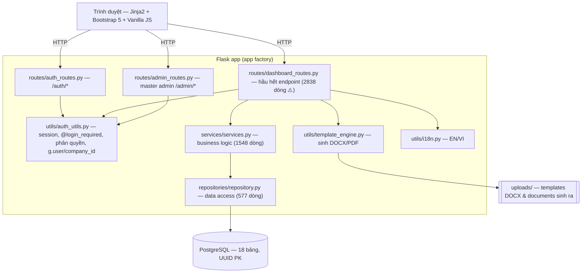
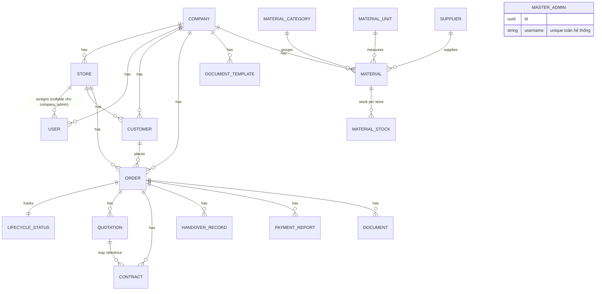

# GIAI ĐOẠN 1 — Bản đồ kiến trúc & Mô hình nghiệp vụ

**Persona:** Kiến trúc sư hệ thống đọc codebase lạ. **Trạng thái:** bản nháp v1 (2026-07-25).

---

## 1. Kiến trúc phân tầng

**Luồng chuẩn:** Route → (auth guard) → Service (nghiệp vụ) → Repository (truy vấn) → DB.
**Nợ kỹ thuật:** `dashboard_routes.py` chứa quá nhiều — nhiều chỗ route gọi thẳng model/repo và tự tính toán, bỏ qua tầng service (sẽ xác minh & liệt kê ở GĐ3, mục Uncle Bob / Fowler).

## 2. Mô hình dữ liệu (ERD rút gọn)

**18 bảng:** companies, stores, users, customers, orders, lifecycle_statuses, quotations, contracts, handover_records, payment_reports, document_templates, documents, material_units, material_categories, suppliers, materials, material_stock, master_admins.

### Ghi chú thiết kế quan trọng
- **Multi-tenant** qua `company_id` trên hầu hết bảng; cách ly dữ liệu dựa vào việc filter theo `g.company_id` ở tầng ứng dụng (KHÔNG có row-level security ở DB → phải kiểm ở GĐ2/3).
- **Tiền tệ:** dùng `Numeric(15,2)` — ✅ đúng (không phải float).
- **Line-items** (`items`) lưu **JSON lồng** trên quotation/contract/handover/payment, kèm subtotal/vat/total cột riêng → dữ liệu tính toán bị denormalized, rủi ro lệch giữa JSON và cột tổng.
- **VAT/phí:** mỗi chứng từ có `vat_rate`, `vat_amount`, `shipping_fee`, `another_fee` riêng.
- **Cascade:** `Company`/`Order` xóa cascade xuống con — xóa công ty/đơn sẽ xóa sạch chứng từ liên quan (cần cảnh báo UX).

## 3. Thực thể nghiệp vụ

| Thực thể | Vai trò nghiệp vụ |
|----------|-------------------|
| Company (Tenant) | Đơn vị cách ly dữ liệu; giữ thông tin pháp lý, VAT mặc định, tài khoản ngân hàng |
| Store | Cửa hàng thuộc công ty; user/customer/order gắn store |
| User | 3 vai trò: `company_admin` (toàn công ty), `store_admin` (1 store), `user` (nhân viên 1 store) |
| MasterAdmin | Quản trị hệ thống, tạo/khóa công ty; ngoài mô hình tenant |
| Customer | Khách hàng của một store |
| Order | Trung tâm vòng đời; giữ tổng tiền, trạng thái hủy |
| LifecycleStatus | Cờ + mốc thời gian cho từng bước vòng đời (1-1 với Order) |
| Quotation → Contract → HandoverRecord → PaymentReport | Chuỗi chứng từ; mỗi cái có trạng thái approve/sign/confirm + cancel |
| Document | File DOCX/PDF sinh ra, gắn với chứng từ nguồn |
| DocumentTemplate | Template DOCX theo công ty + biến thay thế |
| Material + Category/Unit/Supplier/Stock | Danh mục vật tư & tồn kho theo store |

## 4. Danh mục User Journeys (input cho GĐ2 testing)

**Auth & quản trị hệ thống**
1. Master admin đăng nhập → tạo/sửa/khóa Company → tạo company_admin.
2. Company admin đăng nhập → tạo Store, tạo User (store_admin/user), phân quyền.
3. Đăng nhập/đăng xuất, đổi ngôn ngữ EN/VI, phân quyền sai vai trò (negative).

**Vòng đời đơn hàng (lõi)**
4. Tạo Customer → tạo Order.
5. Order → tạo Quotation (nhập line-items, VAT, phí, tính tổng) → duyệt (approve).
6. Quotation đã duyệt → tạo Contract (tạm ứng %, ngày, ngân hàng) → ký (sign).
7. Contract đã ký → tạo HandoverRecord (nghiệm thu từng item, chấp nhận/từ chối) → xác nhận.
8. Tạo PaymentReport `advance` (tạm ứng) và/hoặc `final` → xác nhận → Order `completed`.
9. Sinh tài liệu DOCX/PDF ở mỗi bước; tải xuống; xem lịch sử `documents/`.
10. Hủy (cancel) quotation/contract/handover/payment và hủy Order (kiểm tra `can_cancel`).

**Vật tư**
11. CRUD Category/Unit/Supplier/Material; cập nhật tồn kho theo store; cảnh báo low-stock.

**Cài đặt**
12. Cập nhật thông tin công ty, tài khoản ngân hàng; quản lý template tài liệu.

## 5. Ma trận phân quyền (giả định từ model — cần xác minh GĐ2)

| Hành động | company_admin | store_admin | user |
|-----------|:---:|:---:|:---:|
| Quản lý company/settings/template | ✅ | ❌ | ❌ |
| Tạo store / user | ✅ | ❌(?) | ❌ |
| Xem dữ liệu mọi store trong công ty | ✅ | ❌ (chỉ store mình) | ❌ |
| CRUD customer/order/chứng từ | ✅ | ✅ (store mình) | ✅ (store mình) |

## 6. Câu hỏi mở / giả định nghiệp vụ chưa rõ

1. **Unique số hiệu chứng từ:** hiện `unique=True` toàn hệ thống. Nghiệp vụ đúng thường là **unique theo company**. → *Giả định mặc định: đổi sang unique theo (company_id, number).* Cần xác nhận vì ảnh hưởng cách cấp số.
2. **`advance_skipped`:** LifecycleStatus có cả `advance_paid` và `advance_skipped`. Quy tắc khi nào được bỏ qua tạm ứng để sang final? Suy luận từ code ở GĐ2.
3. **Chuyển trạng thái hợp lệ:** có được tạo Contract khi Quotation chưa duyệt? Tạo Payment `final` khi chưa handover? → sẽ liệt kê state machine hợp lệ ở GĐ2 và chặn bước nhảy sai.
4. **Xóa vs Hủy:** khi nào dùng cascade delete (mất dữ liệu) vs cancel (giữ lịch sử)? UX cần cảnh báo rõ.
5. **Đa store cho user:** một user chỉ thuộc 1 store — có nhu cầu nhiều store không? (giữ nguyên trừ khi có yêu cầu).

## 7. Kết luận GĐ1

Mental model đã đủ để bước sang **GĐ2 (Testing E2E)**: dựng harness pytest trên SQLite, seed dữ liệu tối thiểu, chạy qua 12 nhóm journey ở §4 với happy path + edge case + kiểm tra phân quyền/IDOR + kiểm tra tính toán tiền/VAT. Các quan sát sơ bộ (P1–P8 ở baseline §7) sẽ được xác minh bằng test trước khi kết luận.
