# Giới thiệu

**SofaFlow** là phần mềm quản lý toàn bộ hoạt động của một cơ sở sản xuất / gia công sofa:
từ **khách hàng → báo giá → hợp đồng → sản xuất → bàn giao → thanh toán**, và vòng
**cung ứng vật tư**: theo dõi tồn kho → đề xuất mua → đề nghị mua (PR) → đơn mua (PO) →
nhập kho (GR) → tăng tồn.

Tài liệu này hướng dẫn **từng bước, kèm hình minh họa**. Các số liệu trong hình là **dữ
liệu mẫu** của công ty demo *Ngọc Hân*.

> **Mẹo chung:** Thanh menu trên cùng luôn có các nhóm: **Dashboard · Khách Hàng · Đơn
> Hàng · Nguyên Vật Liệu · Quản Lý**. Góc phải là **ngôn ngữ (EN/VI)** và **tài khoản**.
> Mọi số tiền hiển thị theo đồng Việt Nam (đ).

\newpage

# 1. Đăng nhập

Đăng nhập bằng **email** và **mật khẩu** do quản trị cấp.

**Bước 1.** Mở phần mềm, màn hình đăng nhập hiện ra.

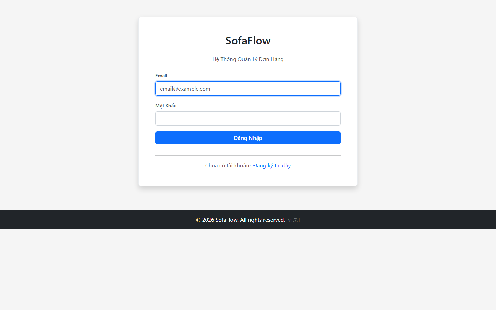

**Bước 2.** Nhập **Email** và **Mật khẩu**, rồi bấm **Đăng nhập**.

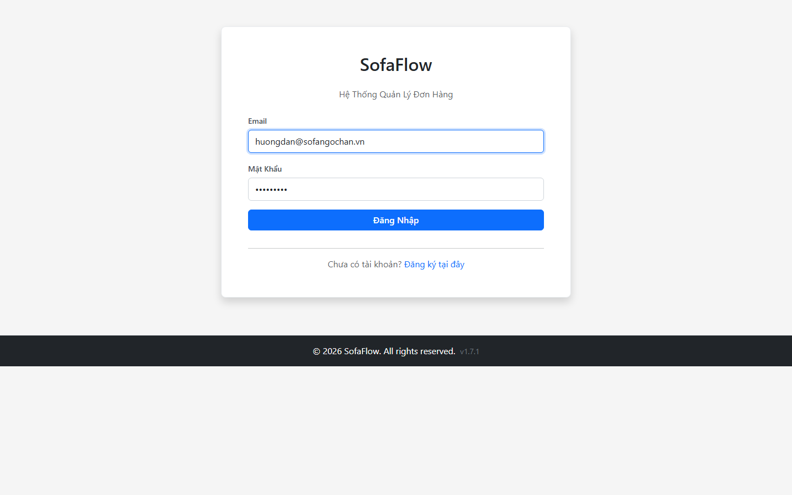

Nếu đúng thông tin, phần mềm sẽ mở **Trang tổng quan**.

\newpage

# 2. Trang tổng quan (Dashboard)

Trang tổng quan cho biết nhanh: **tổng số đơn hàng, đang thực hiện, hoàn thành, đã hủy**,
số khách hàng, và danh sách **đơn hàng gần đây**.

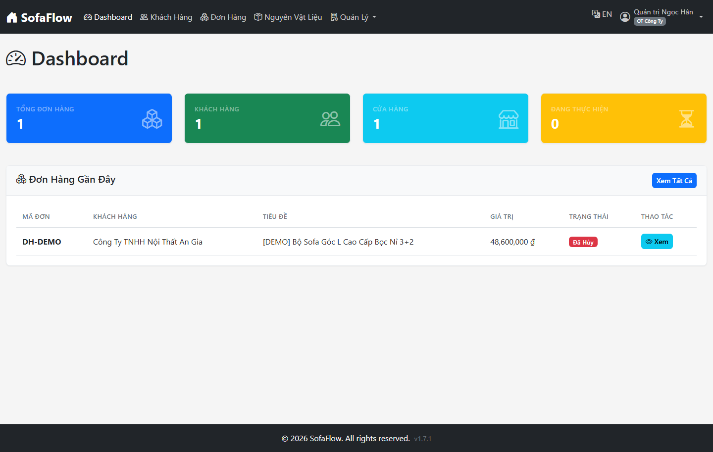

\newpage

# 3. Quản lý Khách hàng

**Bước 1.** Vào menu **Khách Hàng** để xem danh sách.

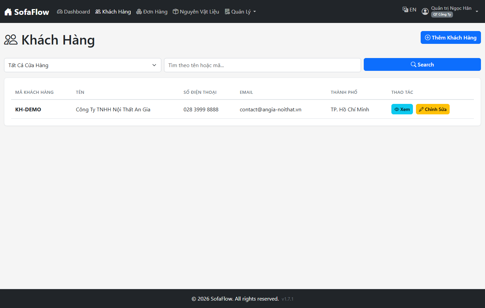

**Bước 2.** Bấm **Thêm Khách Hàng**, điền các thông tin: *Mã khách hàng, Tên, Điện thoại,
Mã số thuế, Địa chỉ, Người đại diện…* rồi bấm **Lưu**.

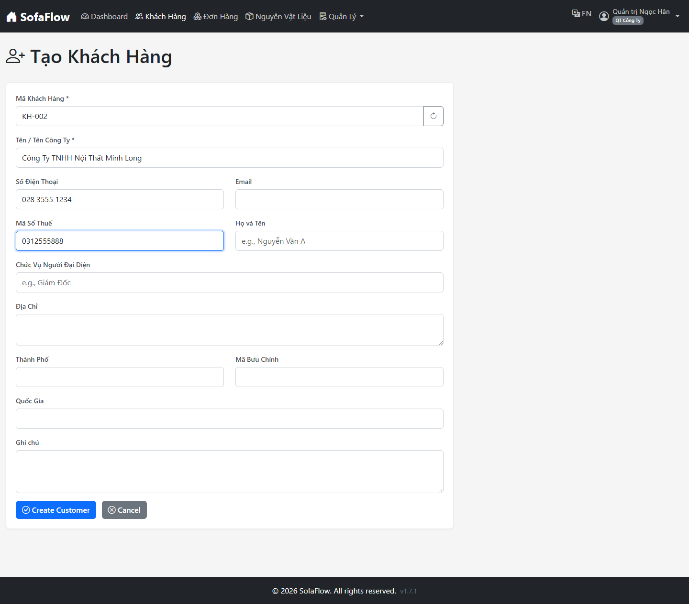

**Bước 3.** Bấm vào một khách hàng để xem **chi tiết** và các đơn hàng của họ.

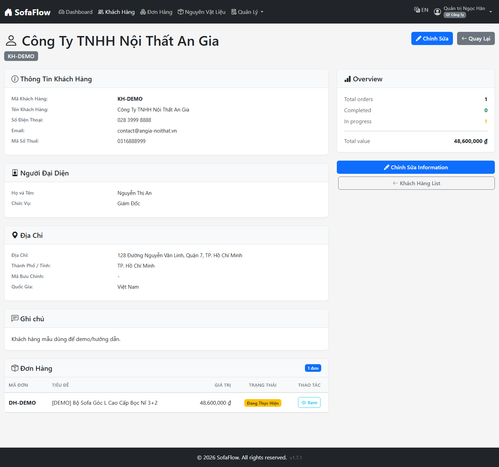

\newpage

# 4. Đơn hàng & vòng đời chứng từ (chi tiết)

Đơn hàng là **trung tâm** của phần mềm. Mọi chứng từ đều gắn với một đơn hàng và đi theo
**trình tự bắt buộc**:

> **Tạo đơn hàng → Báo giá (duyệt) → Hợp đồng (ký) → Tạm ứng (xác nhận) → Biên bản bàn
> giao (xác nhận) → Thanh toán cuối (xác nhận) → Hoàn tất.**

Ở mỗi bước, phần mềm **chỉ mở khóa bước kế tiếp** khi bước trước đã hoàn tất (ví dụ: phải
**duyệt báo giá** mới nên lập hợp đồng; phải **ký hợp đồng** mới lập được phiếu tạm ứng…).
Phần dưới hướng dẫn **từng chứng từ, từng nút bấm**.

## 4.1. Cách tạo đơn hàng

**Bước 1.** Vào menu **Đơn Hàng** trên thanh trên cùng để xem danh sách. Bấm nút **+ Tạo
Đơn Hàng** (góc trên bên phải).

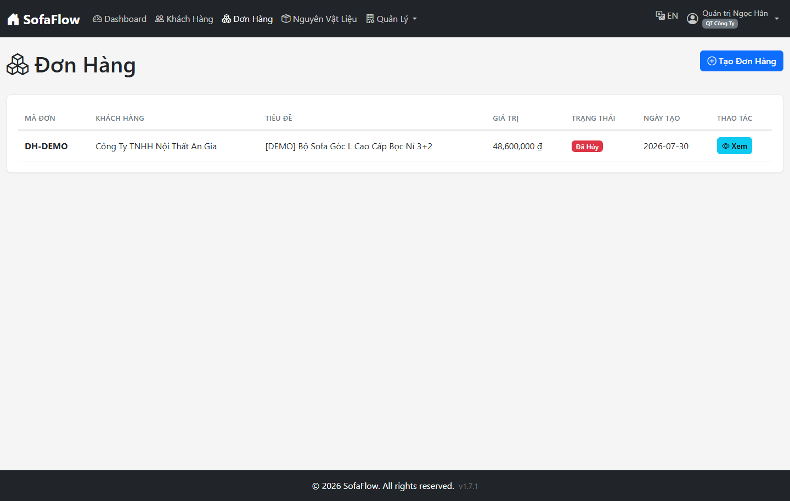

**Bước 2.** Điền biểu mẫu: **Cửa hàng**, **Khách hàng** (chọn từ danh sách), **Mã đơn**,
**Tiêu đề**, **Mô tả**. Bấm **Tạo Đơn Hàng**.

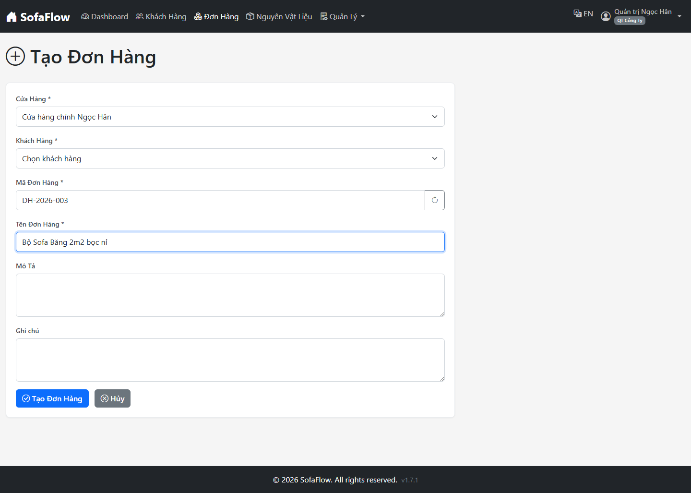

**Bước 3.** Đơn hàng mới hiện ra ở trạng thái **đang chờ** — các chứng từ đều là *Chưa có /
Pending*. Từ đây bạn lần lượt tạo Báo giá → Hợp đồng → …

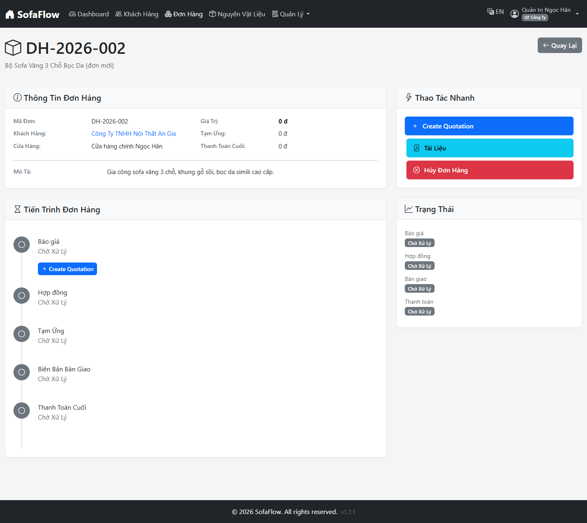

\newpage

## 4.2. Cách tạo Báo giá

**Bước 1.** Trong trang chi tiết đơn hàng, tại khối **Báo giá**, bấm **Tạo báo giá**.

**Bước 2.** Điền: **Số báo giá** (tự sinh, sửa được), **Ngày báo giá**, **Địa điểm**, **Thời
hạn hiệu lực**. Ở **Bảng Hạng Mục**, nhập từng dòng (Hạng mục, ĐVT, SL, Đơn giá) — bấm
**+ Thêm Dòng** để thêm. Nhập **VAT %**, phí (nếu có), **điều khoản thanh toán**. Bấm **Tạo
Báo Giá**.

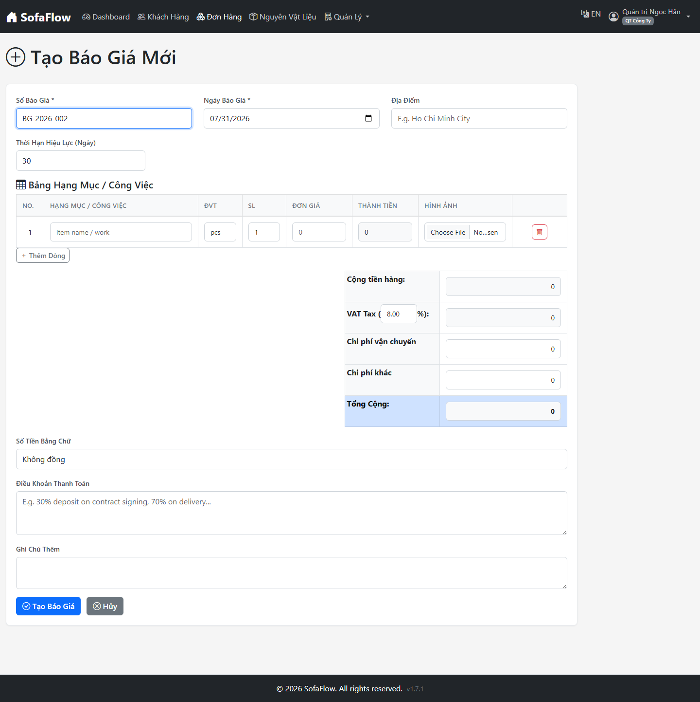

**Bước 3.** Trang **xem báo giá** hiện ra với đầy đủ hạng mục, VAT, tổng tiền. Kiểm tra lại;
nếu cần **sửa** thì bấm **Sửa** (chỉ sửa được khi *chưa duyệt*).

**Bước 4.** Nếu đúng, bấm **Duyệt** (Approve) để chốt báo giá. Sau khi duyệt, báo giá
**khóa** (không sửa) và mở khóa bước **Hợp đồng**.

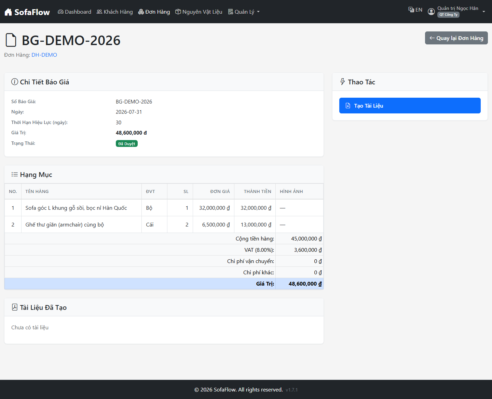

**Bước 5.** **In & tải báo giá:** bấm **Tạo Tài Liệu**, chọn định dạng **PDF** hoặc **DOCX**,
bấm **Tạo**. File xuất hiện ở mục **Tài Liệu Đã Tạo** — bấm để **tải về**.

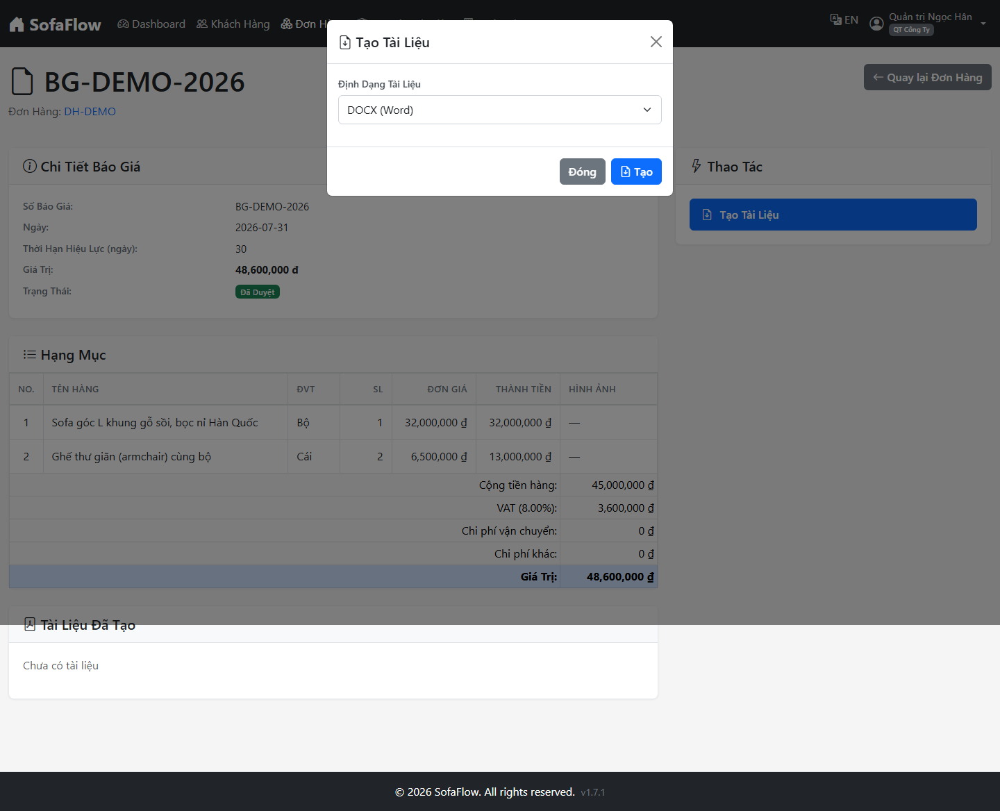

\newpage

## 4.3. Cách tạo Hợp đồng

**Bước 1.** Sau khi **duyệt báo giá**, tại khối **Hợp đồng** trên trang đơn hàng, bấm **Tạo
hợp đồng**.

**Bước 2.** Điền: **Số hợp đồng**, **Ngày ký**, **Địa điểm ký**, **Ngày bắt đầu**, **Số ngày
hoàn thành**. Chọn **Báo giá tham chiếu** — hệ thống **tự sao chép hạng mục** từ báo giá.
Nhập **% Tạm ứng**, chọn **tài khoản ngân hàng** nhận thanh toán, **điều khoản hợp đồng**.
Bấm **Tạo Hợp Đồng**.

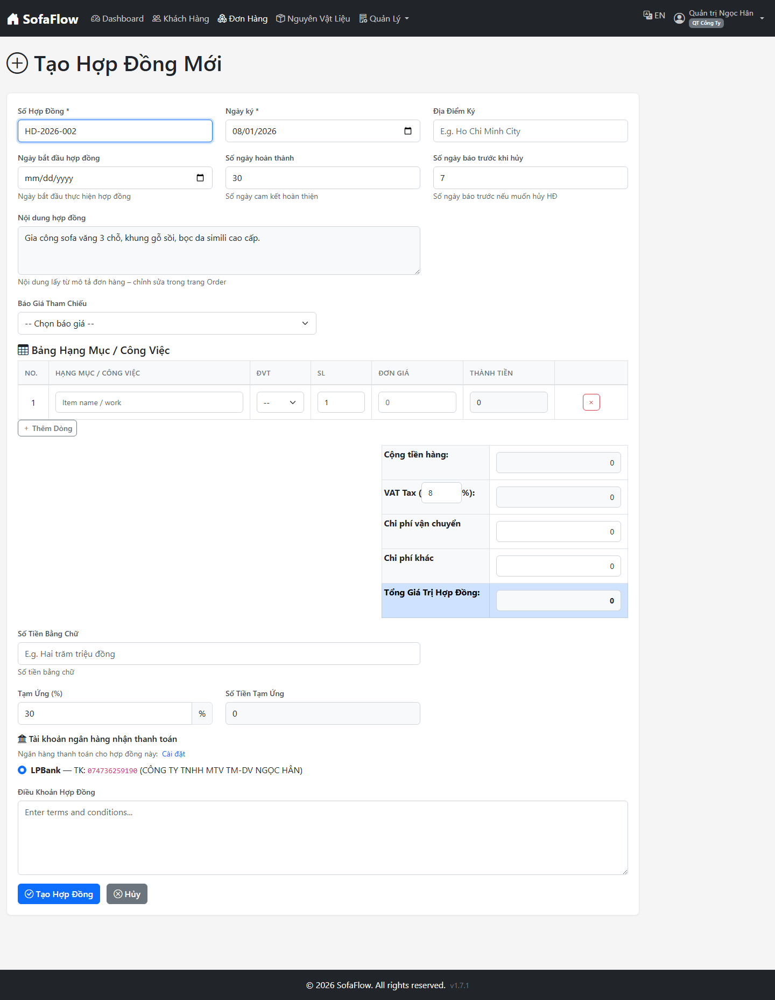

**Bước 3.** Ở trang **xem hợp đồng**, kiểm tra nội dung. Bấm **Sửa** nếu cần (khi *chưa ký*).

**Bước 4.** Bấm **Ký hợp đồng** (Sign). ⭐ *Khi ký, phần mềm **tự tạo Kế hoạch sản xuất** cho
đơn — xem Mục 5.* Hợp đồng đã ký sẽ **khóa**.

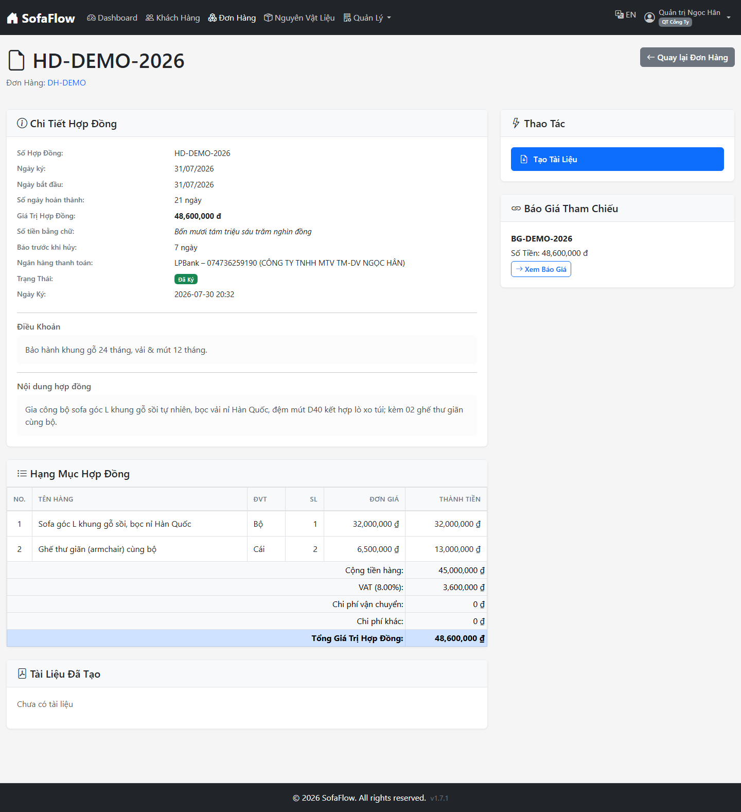

**Bước 5.** **In hợp đồng:** bấm **Tạo Tài Liệu** → chọn PDF/DOCX → **Tạo** → tải về (giống
Bước 5 của Báo giá).

\newpage

## 4.4. Cách tạo phiếu Tạm ứng

**Bước 1.** Sau khi **ký hợp đồng**, tại khối **Tạm ứng** (hoặc nút **Đề Nghị Thanh Toán**),
bấm **Tạo phiếu tạm ứng**.

**Bước 2.** Điền: **Số phiếu**, **Ngày lập / Ngày thanh toán**, **% tạm ứng** và **số tiền
tạm ứng** (thường 30% giá trị hợp đồng), **hình thức thanh toán**. Bấm **Lưu**.

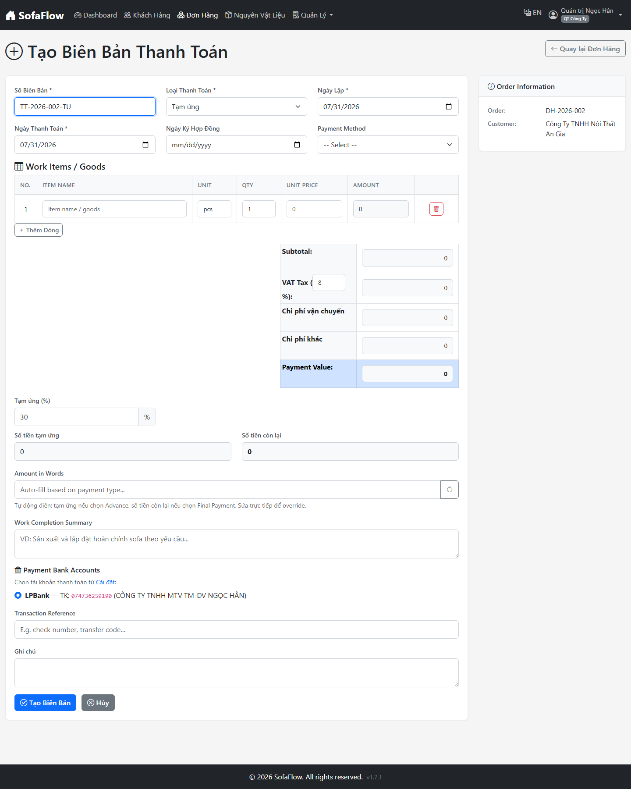

**Bước 3.** Ở trang **xem phiếu**, bấm **Xác nhận** khi đã nhận được tiền tạm ứng. Sau khi
xác nhận, mở khóa bước **Bàn giao**.

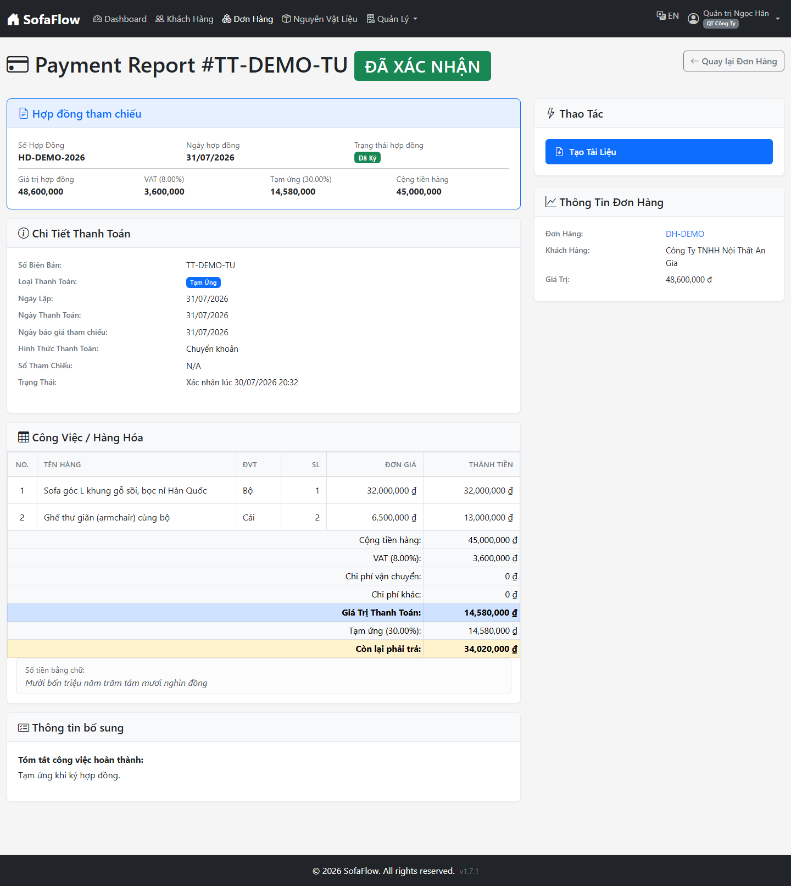

**Bước 4.** **In giấy đề nghị tạm ứng:** bấm **Tạo Tài Liệu** → PDF/DOCX → **Tạo**.

\newpage

## 4.5. Cách tạo Biên bản bàn giao

**Bước 1.** Sau khi **xác nhận tạm ứng**, tại khối **Biên bản bàn giao**, bấm **Tạo biên
bản bàn giao**.

**Bước 2.** Điền: **Số biên bản**, **Ngày lập**, **Ngày bàn giao**, **Địa điểm**, **giờ bắt
đầu/kết thúc**, **người đại diện** hai bên, **tình trạng sản phẩm**. Với mỗi hạng mục, ghi
**SL giao / SL nghiệm thu** và **Đạt / Không đạt**. Bấm **Lưu**.

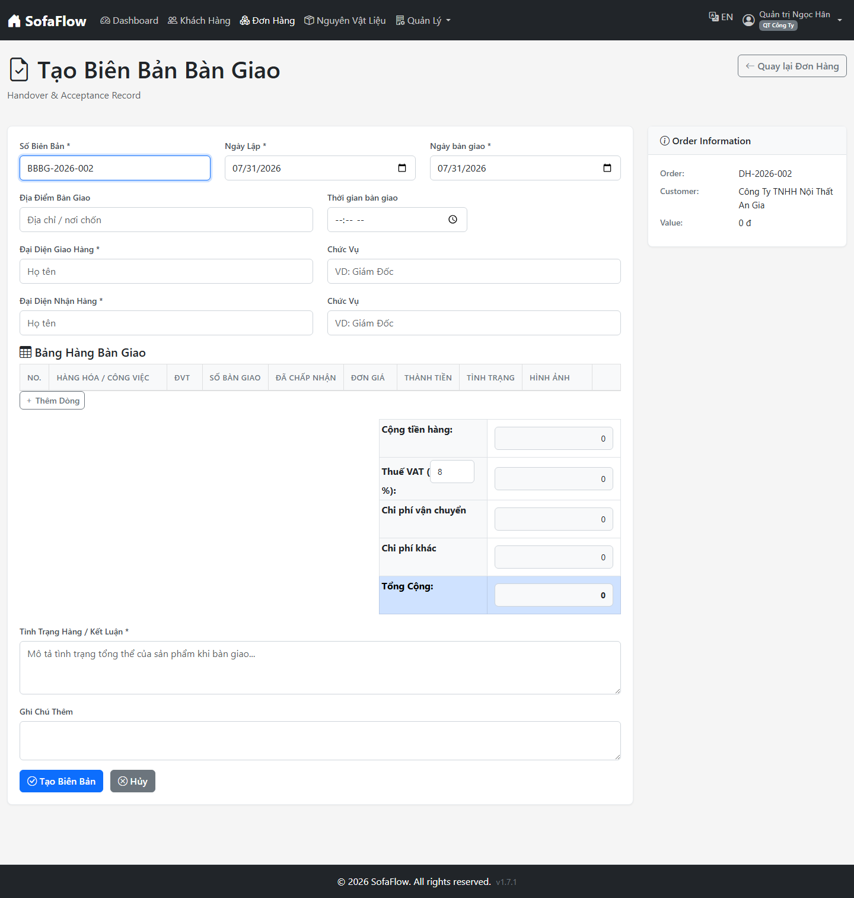

**Bước 3.** Ở trang **xem biên bản**, bấm **Xác nhận** khi khách đã nhận hàng. Sau khi xác
nhận, mở khóa bước **Thanh toán cuối**.

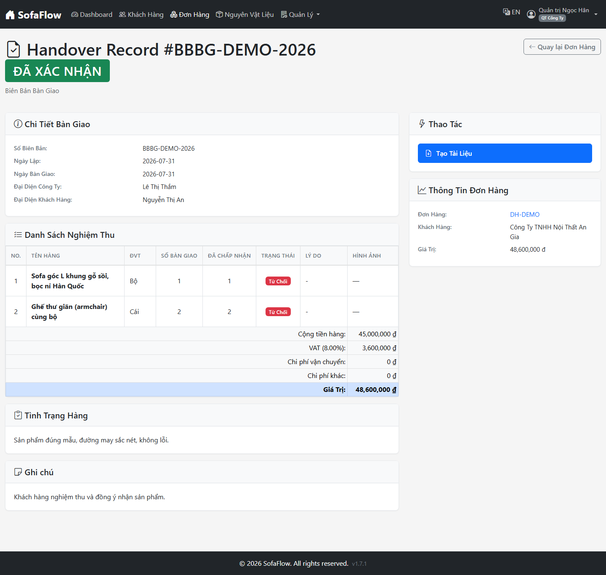

**Bước 4.** **In biên bản:** bấm **Tạo Tài Liệu** → PDF/DOCX → **Tạo**.

\newpage

## 4.6. Cách tạo phiếu Thanh toán cuối

**Bước 1.** Sau khi **xác nhận bàn giao**, bấm **Tạo Biên Bản Thanh Toán Cuối** (nút xanh ở
khối **Thao Tác Nhanh** trên trang đơn hàng). Biểu mẫu giống phiếu tạm ứng nhưng **loại =
Thanh toán cuối**; số tiền là **phần còn lại phải trả**.

**Bước 2.** Ở trang **xem phiếu thanh toán cuối**, kiểm tra: *Tổng giá trị – Đã tạm ứng =
Còn lại phải thanh toán*. Bấm **Xác nhận** khi thu đủ; đơn hàng chuyển **Hoàn tất**.

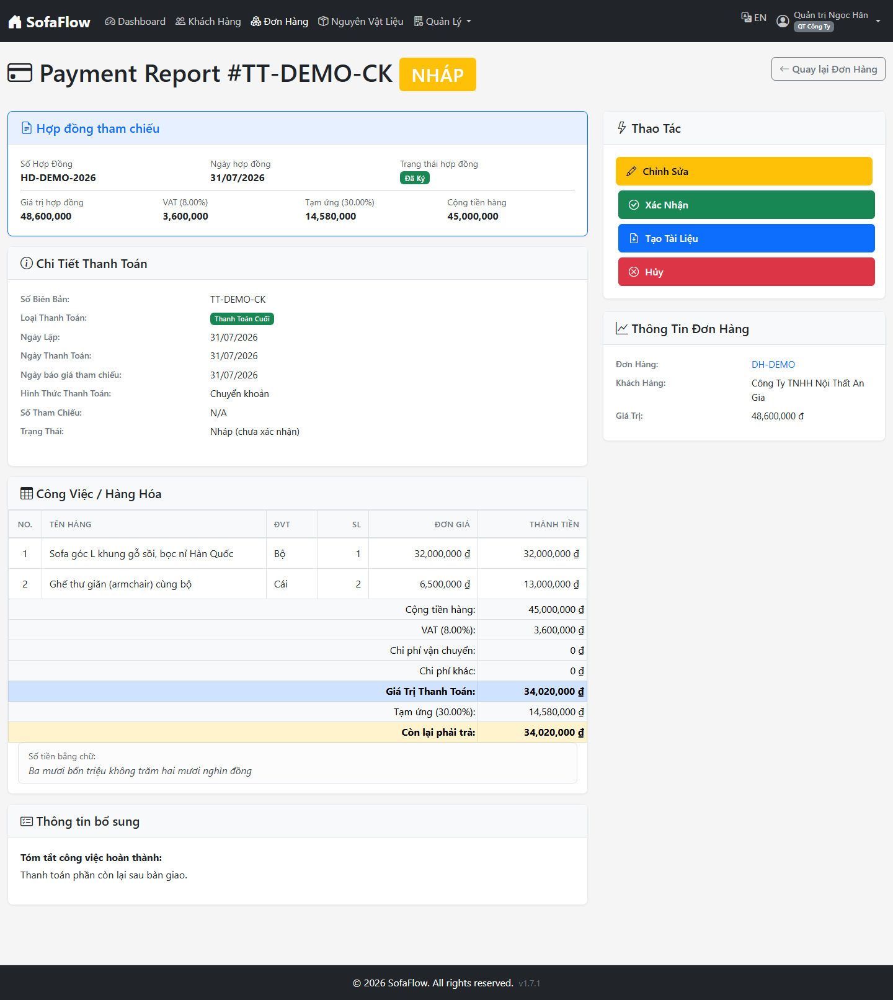

**Bước 3.** **In giấy đề nghị thanh toán:** bấm **Tạo Tài Liệu** → PDF/DOCX → **Tạo**.

\newpage

## 4.7. Toàn cảnh tiến trình trên trang đơn hàng

Khi đã đủ chứng từ, trang chi tiết đơn hàng hiển thị **toàn bộ tiến trình** với trạng thái
từng bước (Đã duyệt / Đã ký / Đã xác nhận…) và bảng **Trạng thái** tổng hợp bên phải. Mỗi
dòng chứng từ có nút **Xem** và **Tạo tài liệu (In)**.

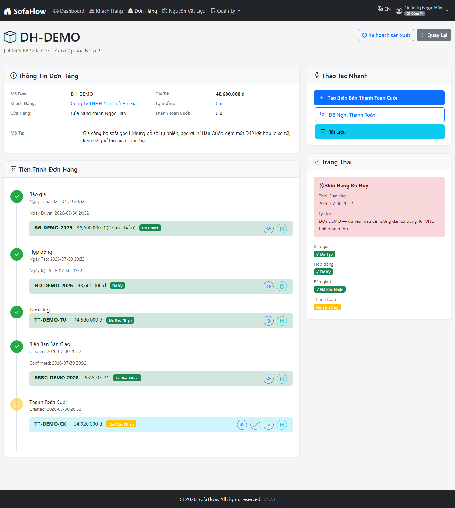

> **Ghi chú về chứng từ in ra:** in được **Báo giá, Hợp đồng, Biên bản bàn giao, Giấy đề
> nghị tạm ứng, Giấy đề nghị thanh toán** ra **PDF** hoặc **DOCX**. Dòng tiêu đề "*…, ngày
> … tháng … năm …*" tự lấy **tỉnh/thành của cửa hàng** và **ngày của chứng từ**.

\newpage

# 5. Kế hoạch sản xuất

Sau khi **hợp đồng được ký**, phần mềm **tự tạo Kế hoạch sản xuất** cho đơn (nút **Kế hoạch
sản xuất** ở góc trên của trang đơn hàng).

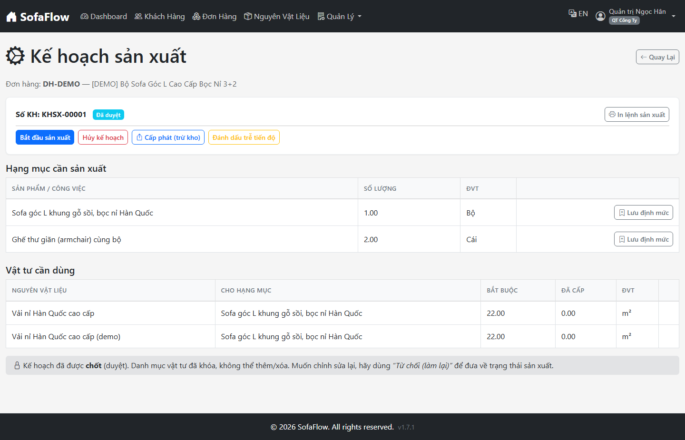

Kế hoạch có **vòng đời** rõ ràng, đổi trạng thái bằng các nút hành động:

> **Nháp → `Duyệt kế hoạch` → Đã duyệt → `Bắt đầu sản xuất` → Đang sản xuất →
> `Đã sản xuất xong` → `Gửi nghiệm thu` → `Đạt nghiệm thu` → `Hoàn tất`.**

- **Chốt lệnh = bấm "Duyệt kế hoạch".** Khi còn *Nháp* bạn sửa danh mục vật tư thoải mái;
  sau khi **Duyệt**, danh mục vật tư **bị khóa** (muốn sửa lại dùng *"Từ chối (làm lại)"*).
- **Cấp phát (trừ kho):** sau khi duyệt, bấm **Cấp phát** để trừ tồn kho theo định mức.
- **In lệnh sản xuất** để gửi xuống xưởng.
- **ĐVT** của vật tư lấy từ danh sách **Đơn vị tính** đã thiết lập.

\newpage

# 6. Nguyên vật liệu (Master data)

Vào menu **Nguyên Vật Liệu**.

**6.1. Danh sách vật tư** — mã, tên, danh mục, ĐVT, tồn kho, giá.

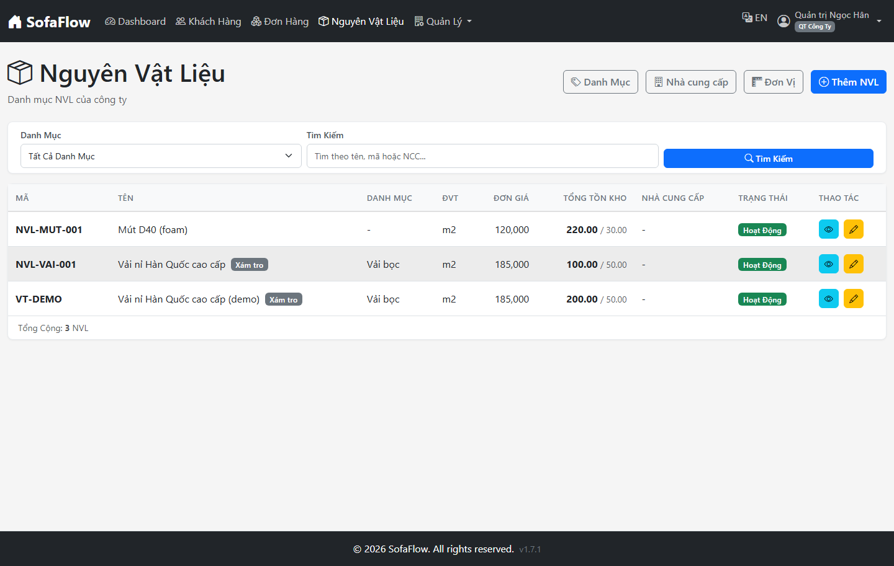

**6.2. Chi tiết một vật tư** — thông số kỹ thuật, giá, tồn kho, nhà cung cấp.

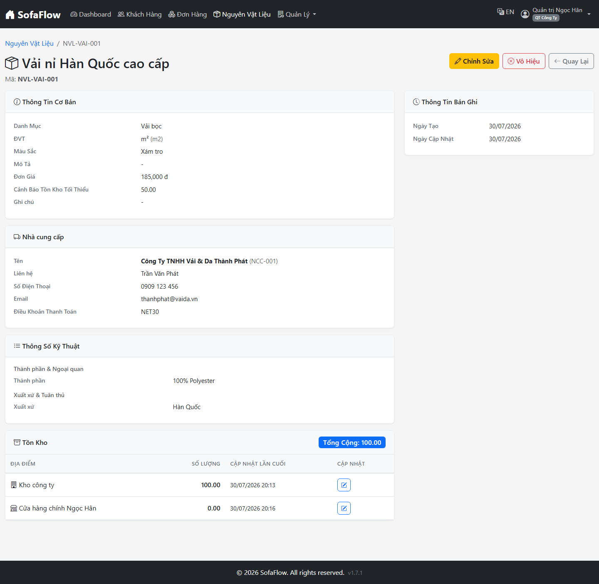

**6.3. Danh mục NVL** — nhóm vật tư theo loại (Vải bọc, Da, Mút & Gòn, Khung gỗ…).

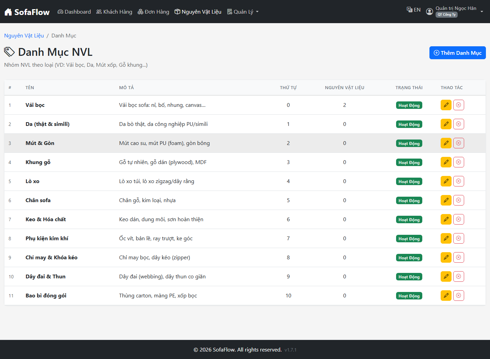

**6.4. Đơn vị tính (ĐVT)** — m², Mét dài, Kg, Cái, Bộ, Cuộn…

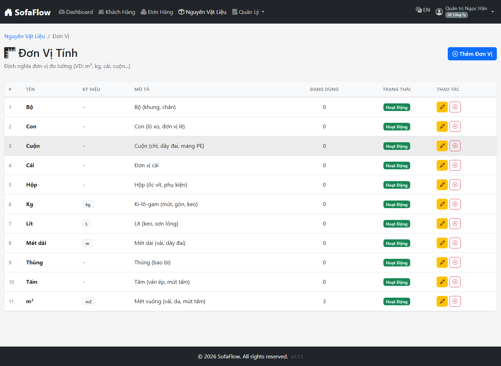

**6.5. Nhà cung cấp** — thông tin liên hệ, điều khoản thanh toán, thời gian giao, đánh giá.

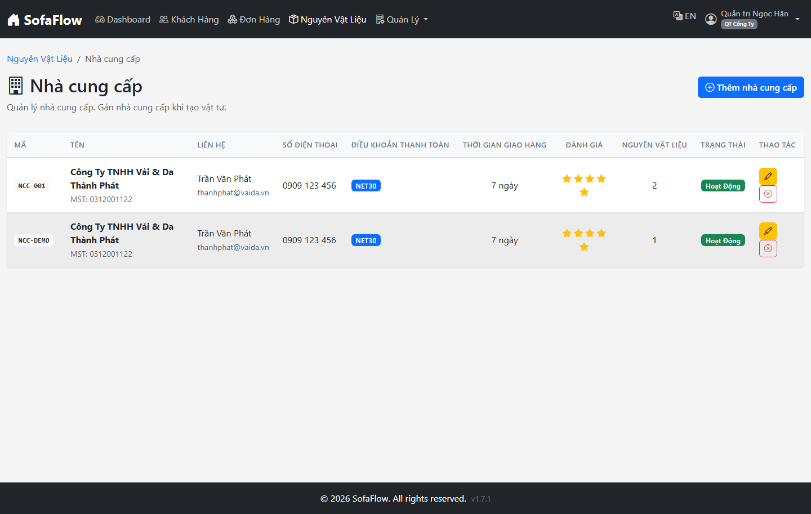

\newpage

# 7. Tồn kho & cảnh báo tồn thấp

Menu **Quản Lý → Tồn kho thấp** liệt kê các vật tư có **tổng tồn dưới mức tối thiểu** để
kịp thời bổ sung.

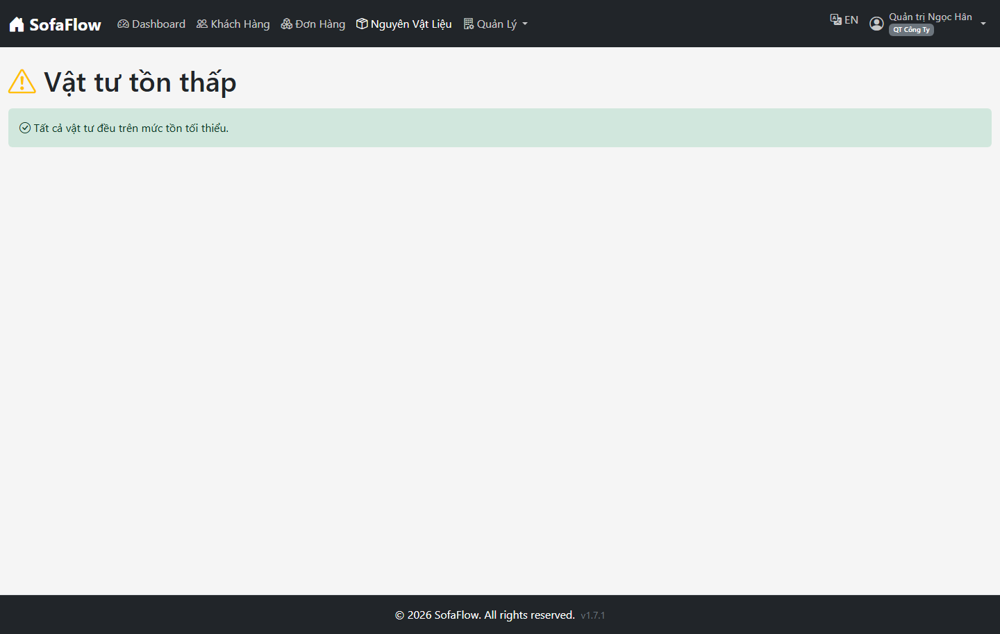

\newpage

# 8. Vòng cung ứng vật tư: Đề xuất → PR → PO → GR

Đây là quy trình mua hàng khép kín (như ERP thu gọn):

> **Đề xuất tự động** → **Đề nghị mua (PR)** → **Đơn mua (PO)** gửi NCC → **Nhập kho (GR)**
> làm **tăng tồn** → tiếp tục sản xuất.

## 8.1. Đề xuất mua hàng (tự động)

Phần mềm tự tính **nhu cầu vật tư** từ các kế hoạch sản xuất đang chạy, **trừ tồn hiện có**,
**bù lên mức tối thiểu**, rồi **gộp theo nhà cung cấp**. Bấm **Tạo đề nghị mua từ đề xuất**
để chuyển sang một Phiếu đề nghị mua (PR) đã điền sẵn.

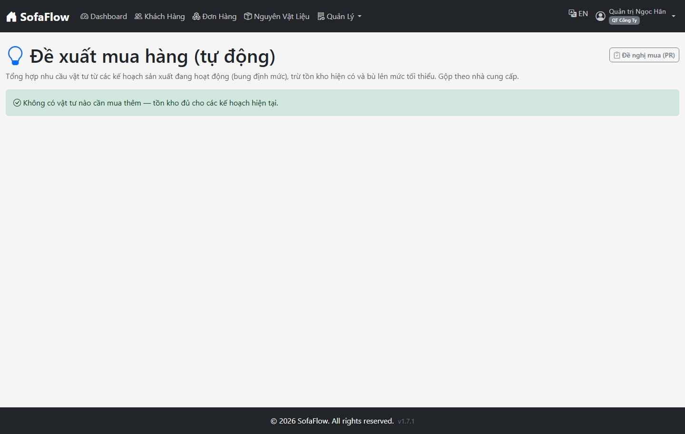

## 8.2. Đề nghị mua hàng (PR)

PR là **nhu cầu mua nội bộ**. Bạn có thể **tạo tay bất kỳ vật tư nào** (kể cả khi tồn kho
chưa chạm mức cảnh báo — để mua dự phòng), hoặc điền sẵn từ đề xuất tự động.

**Bước 1.** Menu **Quản Lý → Đề nghị mua (PR)** → danh sách.

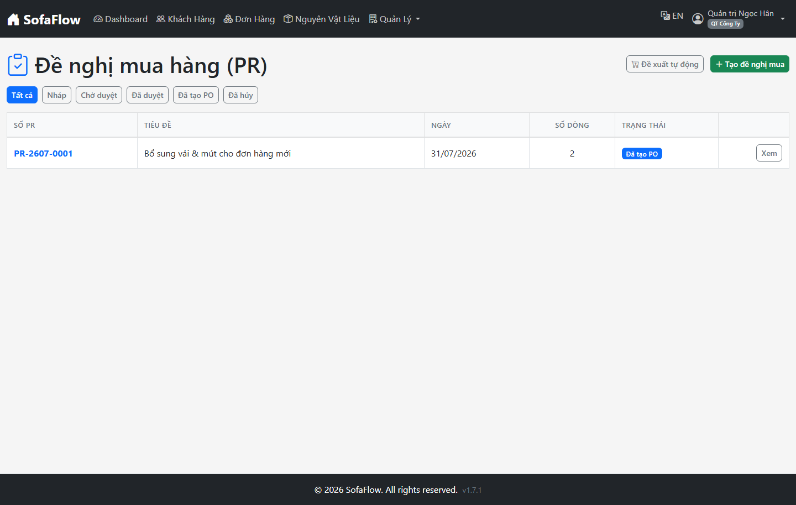

**Bước 2.** Bấm **Tạo đề nghị mua**, nhập tiêu đề/kho cần, và **thêm các dòng vật tư**
(chọn vật tư, số lượng, ĐVT). Bấm **Lưu**.

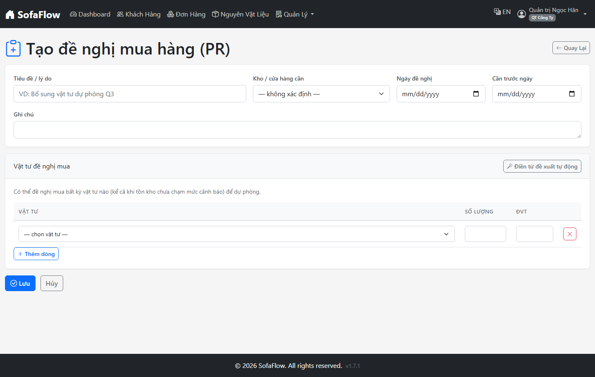

**Bước 3.** Mở PR để xem chi tiết. Vòng đời: **Nháp → `Gửi duyệt` → `Duyệt` → `Tạo đơn mua
(PO)`**. Sau khi **Duyệt**, bấm **Tạo đơn mua (PO)** — phần mềm tạo PO **gộp theo nhà cung
cấp** và đánh dấu PR *Đã tạo PO*.

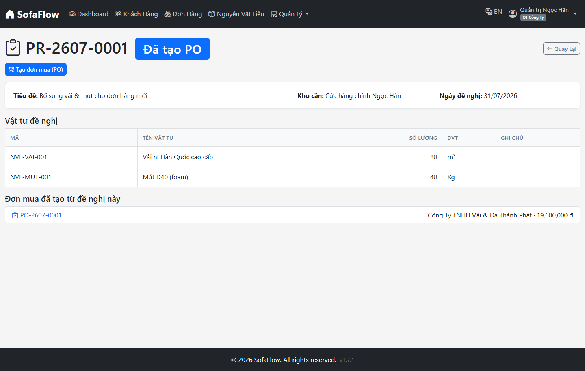

## 8.3. Đơn mua hàng (PO)

PO là **đơn đặt hàng gửi nhà cung cấp**. Có thể tạo **từ PR** hoặc **tạo trực tiếp**.

**Bước 1.** Menu **Quản Lý → Đơn mua hàng (PO)** → danh sách.

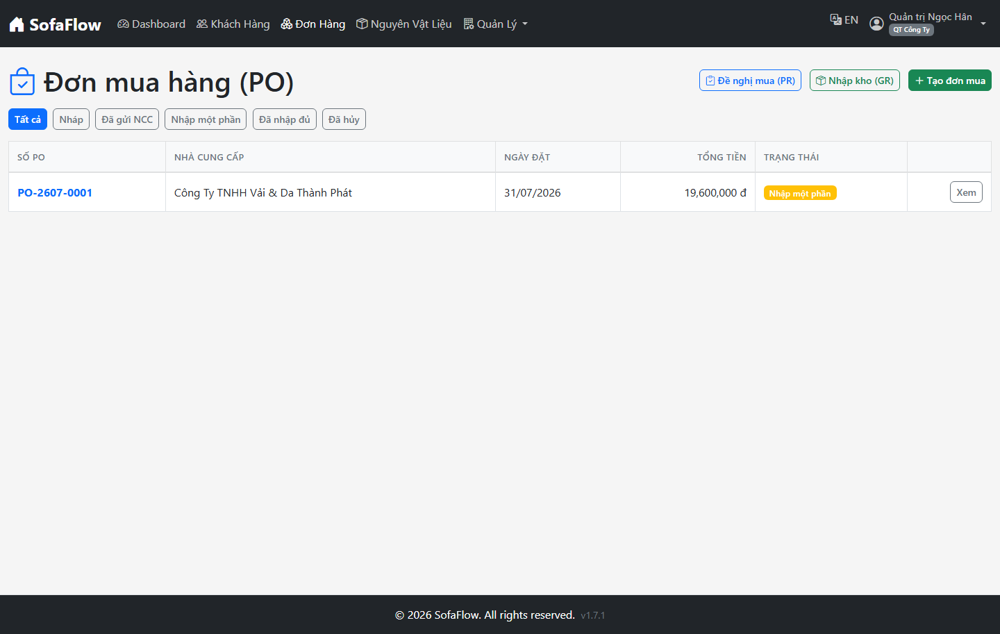

**Bước 2.** Bấm **Tạo đơn mua**, chọn **nhà cung cấp, kho nhập, VAT**, thêm **các dòng vật
tư** (vật tư, số lượng, đơn giá — đơn giá tự điền theo giá NVL), rồi **Lưu một lần**.

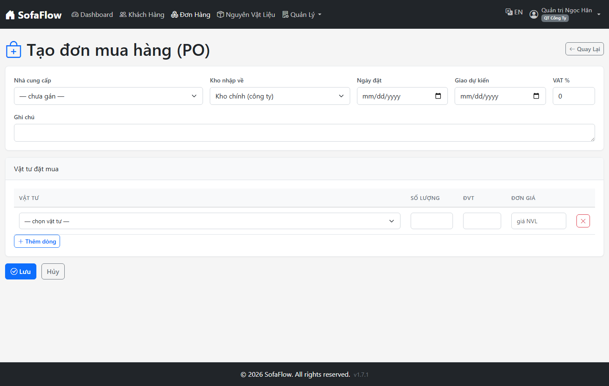

**Bước 3.** Mở PO để xem chi tiết. Bấm **Gửi nhà cung cấp** để chốt đơn, **In đơn đặt
hàng** để gửi NCC. Khi hàng về, dùng khung **Nhận hàng & nhập kho (GR)** ngay trên trang PO.

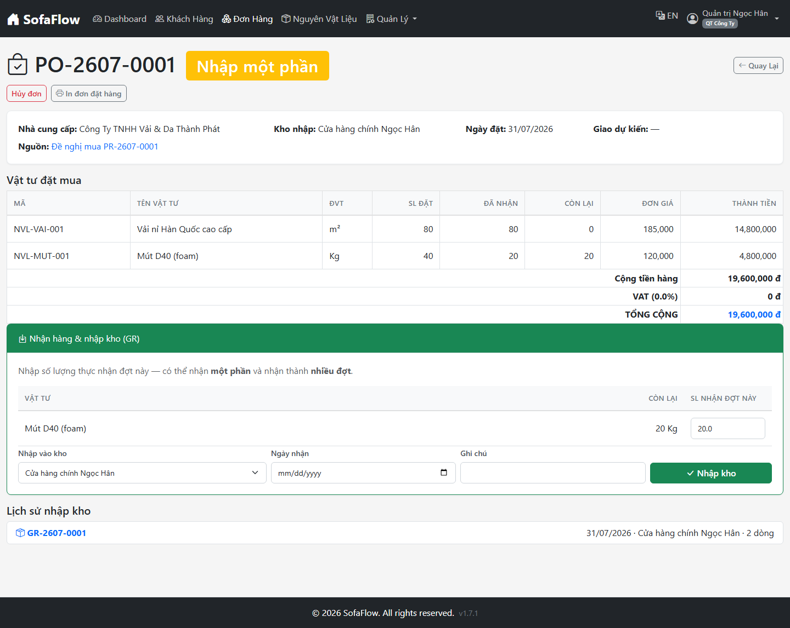

## 8.4. Nhập kho (GR)

Khi hàng về, **nhập số lượng thực nhận** — phần mềm **tăng tồn kho** tương ứng và cập nhật
trạng thái đơn mua:

- **Nhận một phần:** nhập ít hơn số đặt → đơn mua chuyển **"Nhập một phần"**, phần còn lại
  vẫn chờ.
- **Nhận nhiều đợt:** mỗi lần nhận là **một phiếu nhập kho (GR)** riêng.
- **Nhận đủ:** khi tổng nhận = tổng đặt → đơn mua chuyển **"Đã nhập đủ"**.

**Bước 1.** Menu **Quản Lý → Nhập kho (GR)** → danh sách các phiếu nhập.

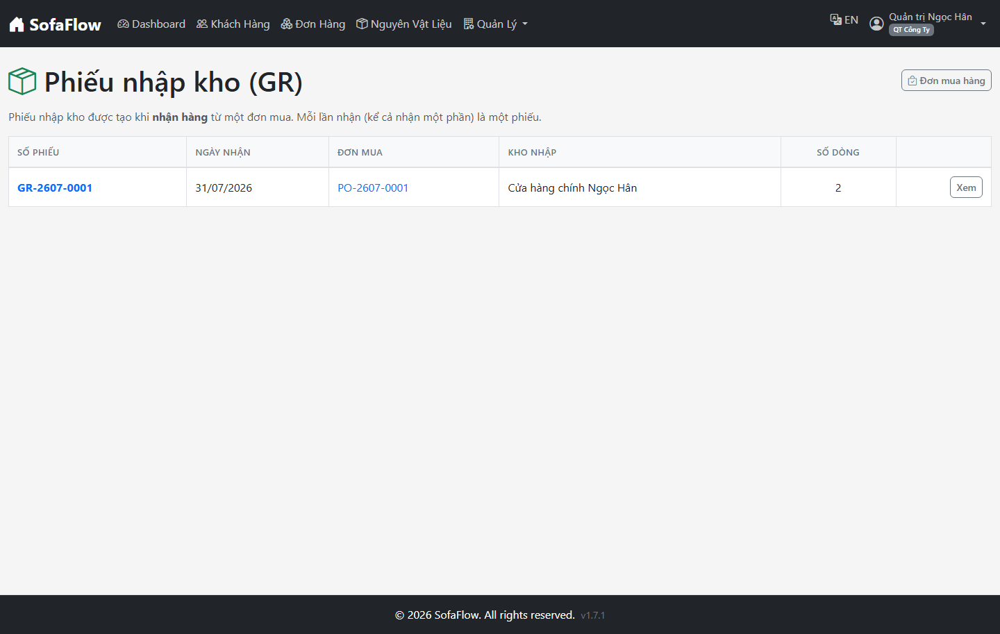

**Bước 2.** Mở một phiếu để xem chi tiết: kho nhập, đơn mua nguồn, và các dòng vật tư đã
nhận.

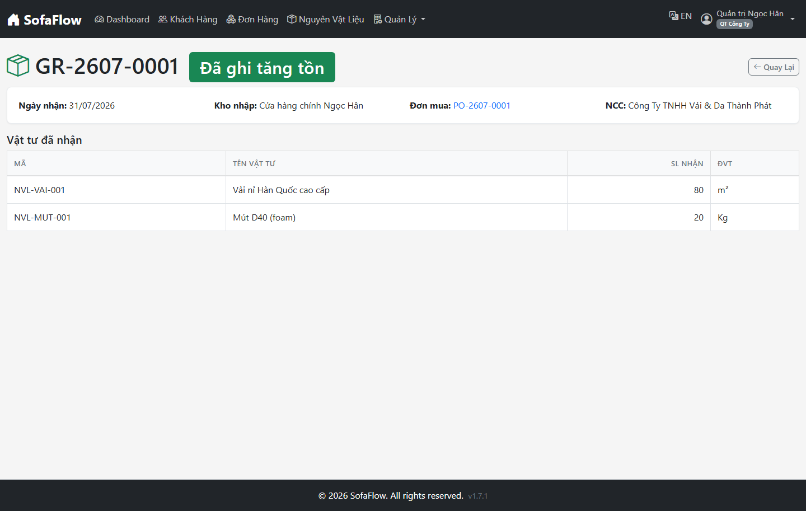

\newpage

# 9. Cài đặt

**9.1. Thông tin công ty** — tên, địa chỉ, MST, người đại diện, **tài khoản ngân hàng**
(dùng in trên chứng từ), thuế VAT mặc định.

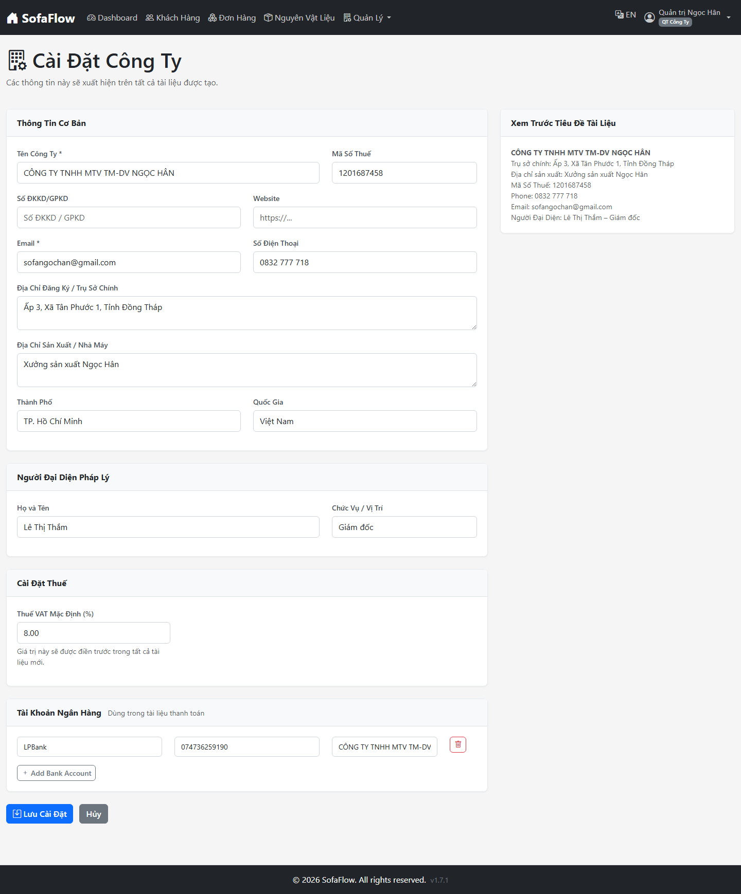

**9.2. Trường mở rộng (tùy biến)** — với mỗi loại chức năng (khách hàng, vật tư, đơn mua…)
bạn có thể **bật thêm tối đa 10 trường tùy chỉnh**, đặt nhãn, kiểu dữ liệu và bắt buộc hay
không. Trường được bật sẽ hiện trên biểu mẫu tương ứng.

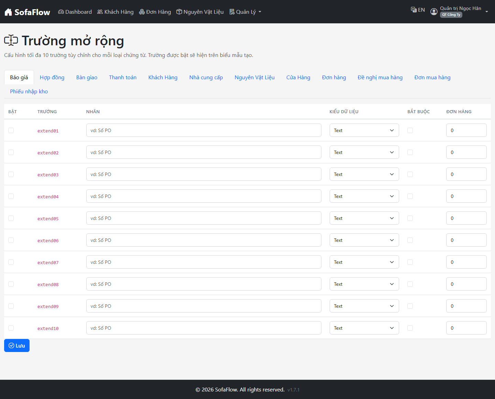

\newpage

# Phụ lục: Tóm tắt vòng vận hành

```
Khách hàng → Đơn hàng → Báo giá → Hợp đồng (ký)
                                      │
                                      ▼
                            Kế hoạch sản xuất → Cấp phát (TRỪ tồn kho)
                                      │
                                      ▼
                         Tồn thấp → Đề xuất → PR → PO (gửi NCC)
                                      │
                                      ▼
                            Nhập kho (GR) → TĂNG tồn → sản xuất tiếp
                                      │
                                      ▼
                         Bàn giao → Thanh toán → Hoàn tất
```

*— Hết —*
